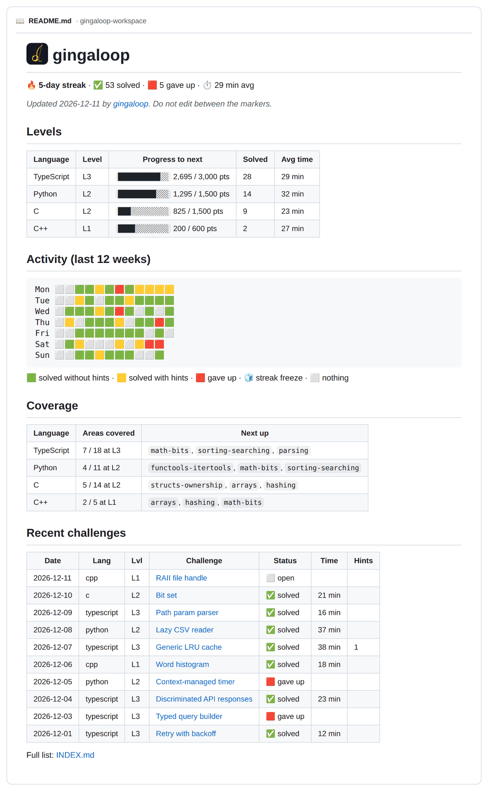

<p align="center">
  
</p>

<h1 align="center">gingaloop</h1>

<p align="center"><b>Daily coding challenges, generated by Claude, in any language, tested in a sandbox.</b></p>

## Why

I built this after noticing my own basic programming and logic getting rusty from leaning on AI at
work. Using AI isn't the problem; losing the skill is. So the split is deliberate: the AI writes and
validates the exercise, you write every line of the solution, and then the AI reviews *your* code.
Write, test, get a code review, learn: the same loop as real work, aimed at keeping the fundamentals
sharp.

## How it works

Every day, `ginga` asks [Claude Code](https://claude.com/claude-code) to write a fresh challenge in
one of your languages (shuffled, no repeats until each has had its turn), when you run it or on a
schedule. Each challenge has a description, a starter to edit, automated tests, three tiered hints,
and a reference solution with a written explanation. The solution stays encrypted until you solve
the challenge or give up. Difficulty is earned: each language has its own level from 1 to 10, and
you level up by earning points with verified solves.

> The name: in capoeira, the *ginga* is the swaying base movement you practice every single day.
> Everything else is built on it. This is a loop of that daily practice, for code. The logo is a
> berimbau, the bow that calls the rhythm of the roda, with its gourd turned into a loop.

```
$ ginga daily       # today's challenge: next language from your rotation, at your level
Generating a level-1 Python challenge on Strings and text processing with Claude …
Validating in the sandbox …
✔ Run-length encoding  (python, level 1, ~20 min, implement)
  ~/gingaloop/challenges/2026-10-02-python-run-length-encoding

$ ginga new c       # or any language you like, any time (--level N up to yours)

$ ginga open        # README + starter in your $EDITOR (starts the timer)
$ ginga test        # run the tests against your starter/ (in a container)
$ ginga hint        # reveal hint 1 of 3 (recorded)
$ ginga done        # tests pass → "Minutes spent [37]:" (enter accepts) → solution unlocked
$ ginga review      # optional: Claude reviews your code, running probes in the sandbox
$ ginga commit --push   # record the day in your workspace repo (plain git, no Claude tokens)
$ ginga rank
🔥 Streak: 3 days  (next freeze in 4 solve days, max 2)

python       L1  ██░░░░░░░░░░  185 / 600 pts (415 to L2)   2 solved, 0 gave up  22 min avg
```

## Requirements

- Node.js ≥ 22.18
- [Claude Code](https://claude.com/claude-code) (`claude` on your PATH, logged in)
- Docker or Podman, which runs every piece of generated code
- Linux with systemd for the daily schedule (optional; `ginga new` works anywhere)

You do **not** need compilers or language runtimes on your machine. Each language runs in its own
container image.

## Quick start

gingaloop isn't on npm yet, so install it from GitHub:

```sh
npm install -g github:JarnDev/gingaloop
ginga init ~/gingaloop
```

Or clone the repo and run `npm link` in it, so `ginga` follows your checkout.

`init` never overwrites existing files (point it at an existing repo and it only adds what's
missing), and it only becomes your default workspace if you have none yet or pass `--default`.
It asks for your **rotation** (any languages, e.g. `python,typescript,c,rust`), the order and the
daily time. By default the order is **random without repeats**: each cycle draws every language once
in a shuffled order, then the bag refills. Choose `ordered` to follow your list instead
(`ginga rotation mode random|ordered`). Then:

```sh
ginga doctor --pull          # check everything and pre-pull the language images
ginga daily                  # today's challenge, whenever you sit down to practice
ginga new rust               # an extra one in any language
```

Scheduling is optional. `ginga daily` is the whole daily habit: run it yourself when you start
practicing (it makes at most one challenge per day), or let a timer have it ready for you:

```sh
ginga schedule install       # systemd user timer: today's challenge waits for you at 08:00
```

## Workspace

The workspace is a plain folder, separate from the tool (make it a git repo if you like):

```
~/gingaloop/
  gingaloop.json     your settings (see Configuration)
  progress.jsonl     append-only log: generated / hint / solved / gaveup events
  INDEX.md           table of all challenges and their status (regenerated)
  challenges/        one folder per challenge, from `ginga daily` and `ginga new` alike
  profiles/          language profiles bootstrapped for languages without a built-in one
  .staging/          work in progress while Claude generates (failed attempts in _failed/)
  .logs/             one log per generation
```

Levels, streak and the daily bag are all computed from `progress.jsonl`, so there is no other state.



<sub>The workspace README after ten weeks of practice (sample data from `node scripts/sample-dashboard.mjs`).</sub>

**Make it a git repo** to keep a history of your practice: `.gitignore` and `.gitattributes` are
already set up. `ginga` never commits on its own, but `ginga commit` does it in one step with a
message built from your progress (no AI involved, so it's free), and `ginga push` publishes it:

```
$ ginga commit --push
  practice(2026-10-03): solve 1, new 1

  - new(python): URL slugs for blog titles · L1 · strings
  - solve(python): URL slugs for blog titles · L1 · 30 min · 0 hints · +100 pts
  - notes(python): URL slugs for blog titles

Commit with this message? [Y]es / [e]dit / [n]o [y]
```

It uses your normal git setup (signing, hooks), sets the upstream on the first push, and with
`--yes` works without a terminal. Its `README.md` is a **progress
dashboard** (streak, levels with progress bars, a 12-week activity grid with 🟩 clean solves, 🟨 solves
with hints and 🟥 give-ups, coverage and recent
challenges), rewritten after every `daily`, `new`, `hint`, `done`, `giveup` and `rank`. Only the
part between `<!-- gingaloop:start -->` and `<!-- gingaloop:end -->` is generated; write whatever
you like around it.

If you push the workspace to a **public** remote, remember that each README is also its challenge's
unlock key, so anyone can read the solutions. A private repo avoids that.

## A challenge

Every challenge, daily or on demand, lands in `challenges/<date>-<lang>-<slug>/`:

```
challenges/2026-10-02-c-ring-buffer/
  README.md        the problem, examples, constraints  (also the decryption key, see below)
  challenge.json   level, type, topics, test command, source (daily | manual)
  starter/         ← you work here
  tests/           the test suite (visible; read it!)
  locked.bin       encrypted: solution/, solution/EXPLANATION.md, bugs/, hints
  NOTES.md         your notes
```

After `ginga done` or `ginga giveup`, `locked.bin` is replaced by `solution/` (with `EXPLANATION.md`:
the approach, a traced example, complexity, alternatives, the common bugs, language idioms and two
"level up" follow-ups), `bugs/` (the typical mistakes the tests catch) and `hints.md`.

### Challenge types

| Type | From | You… | Graded by |
|---|---|---|---|
| **implement** | L1 | write the code from the spec | the tests |
| **fix-the-bug** | L1 | fix a buggy implementation | the tests |
| **refactor** | L1 | make poor code meet a new requirement | the tests |
| **extend** | L1 | add a feature to a working module | the tests |
| **write-the-tests** | L1 | write the test suite for a visible, correct `subject/` | your tests must pass on it **and fail on every hidden buggy version** (`ginga test` shows "caught 3/4") |
| **trace** | L1 | read `program/` and write its exact output in `starter/answer.txt` | the real output (the tests never print it) |
| **port** | L2 | rewrite `source/`, a solution in another language from your rotation | the tests, in the target language |
| **debug-from-symptom** | L3 | fix a bug when the README shows only the symptom | the tests (and the symptom is reproduced for real) |
| **optimize** | L3 | make correct-but-slow code meet a time budget | correctness + a budget test, sized so a slower complexity class can't pass even on a fast machine |

`port` needs a source you can read at the challenge's difficulty: another rotation language at
L2 or higher and at most one level below the challenge. If none qualifies at your level, the port
is generated one level lower (never more); with an explicit `--level`, it isn't lowered. The source comes from a different language family when possible
(Python ↔ JS/TS ↔ C/C++), so the real porting traps show up: floor vs truncating division, bytes vs
characters, mutability, map ordering. SQL and React are never ported.

The daily mix is weighted so **implement stays at least half** of your challenges at every level;
`ginga new <lang> --type trace` picks one explicitly. Extra folders (`subject/`, `program/`,
`source/`) are visible, and `ginga open` opens them with the starter.

## Levels, points and streaks

Each language has its own level, from **1 to 10**. The rules are modeled on
[Codewars ranks](https://docs.codewars.com/gamification/ranks/) and
[Duolingo streak freezes](https://blog.duolingo.com/how-duolingo-streak-builds-habit/):

**Points.** `ginga done` runs the tests itself, and only then does the solve earn points:

| Your solve | Points |
|---|---|
| at your current level | 100 |
| 1 level below | 30 |
| 2+ levels below | 5 |
| after giving up | 0 |

Hints scale that: 0 hints 100%, 1 → 85%, 2 → 70%, 3 → 50%.

**Levels** cost more and more points (cumulative):

| L2 | L3 | L4 | L5 | L6 | L7 | L8 | L9 | L10 |
|---|---|---|---|---|---|---|---|---|
| 600 | 1,500 | 3,000 | 5,500 | 9,500 | 16,000 | 26,000 | 42,000 | 68,000 |

That's 6 clean solves for L2, 9 more for L3, then 15, 25, 40… L10 is a multi-year goal.

**Points are necessary but not enough.** To unlock the next level you also need:

- **Breadth:** a clean solve in **every area** unlocked at your current level (`ginga coverage` shows
  them), so you can't skip a topic;
- **Consistency:** your **last 3 solves at your level are clean** (at most one hint, not after
  giving up).

"Clean" is deliberately strict: points measure effort, the gates measure mastery. `ginga rank` shows
what's still missing (`missing areas: hashing · clean streak 2/3`). Levels you reached before these
gates existed are kept.

- The daily job always generates at your level. `ginga new <lang> --level N` picks any level **up
  to** yours, never above.
- Solving easier challenges still counts a little, but farming them is slow: at 5 points, two or
  more levels below is 20× slower than playing at your level.
- **Reviews** (a new problem on the same idea) come back **3, 7 and 21 days** later, spaced the way
  memory research recommends, for every challenge you gave up on **or struggled with** (2+ hints, or
  more than twice the estimated time). If the machine was off, they come on the first daily after.
- Levels are recomputed from `progress.jsonl`, so tuning `leveling` in `gingaloop.json` re-scores
  your history.

**Streak.** Count of consecutive days with at least one solve. Every 7 solve days earns a
❄️ **freeze** (hold up to 2); a missed day uses one automatically instead of breaking the streak.

There are deliberately no leaderboards: research on gamified learning found that competition and
point-chasing [distract from learning](https://arxiv.org/abs/2203.16175).

## Coverage map

Every challenge targets a **practice area**. There are generic ones (strings, hashing, parsing, trees,
graphs, dynamic programming, concurrency…, in [`prompts/areas.json`](prompts/areas.json)) plus areas
specific to each language (C pointers and memory, Node streams, TypeScript generics, C++ move
semantics…, in each profile). Each area has a minimum level, so graphs don't show up at L1.

The generator picks the **least-covered area unlocked at your level** (ties at random), so practice
spreads out instead of circling a few favorite topics. Reviews keep the area of the challenge you gave
up on.

```
$ ginga coverage c
C (L1): 2/6 unlocked areas covered
  ★ c-strings            ■ 1
  ★ pointers-arrays      ■ 1
    strings              □ not yet
    …
  ★ structs-ownership    ·  unlocks at L2
```

Choose an area yourself with `ginga new c --area dynamic-memory`.

## Locked solutions: honest version

The solution bundle is encrypted with AES-256-GCM using **SHA-256 of the challenge's README.md** as
the key. There are no keys to store or carry between machines, and editing the README breaks the lock
(restore it with `git checkout` and run the command again).

This is **friction, not security**. Anyone can derive the key from the README. It exists so you don't
spoil the solution by accident, or "just glance" at it. It won't stop you if you decide to cheat.

To keep the key from breaking by accident:

- each challenge README is **read-only** once published (your editor will warn before writing);
- READMEs are normalized at publish (LF, no trailing spaces, one final newline), and unlocking
  tries that normal form too, so editors that strip whitespace or switch line endings don't matter;
- the workspace's `.gitattributes` marks READMEs as `-text`, so git never rewrites them;
- the list of bug variants lives inside the lock too, so `challenge.json` doesn't spoil the
  common mistakes.

## Sandbox

All generated code runs in a container, never on your machine. That includes your `ginga test` runs,
validation, and every experiment Claude runs while writing a challenge. Each run:

- works on a **throwaway copy** of the challenge folder (the original is never mounted);
- has **no network**, runs as your uid with **all capabilities dropped**, `no-new-privileges`, a
  **read-only** root filesystem and a small `/tmp`;
- is limited to 1 GB of memory, 2 CPUs and 256 processes, with a timeout (configurable in `gingaloop.json`).

While generating, Claude may only write files in its staging directory, and its only shell command
is `ginga sandbox run --jail …`. With `--jail`, every folder or profile it names must resolve (after
symlinks) inside that staging directory, and no option can be given twice, so the command can't be
widened. Profiles written by Claude can't add `docker run` flags; only built-in profiles may, from
a short whitelist.

Membership in the `docker` group is root-equivalent on the host. For stronger isolation use rootless
Docker or Podman (`"sandbox": { "engine": "podman" }`; gingaloop adds `--userns=keep-id` and an
SELinux `:z` label for it).

## Languages

Built-in profiles: **python, javascript, typescript, nodejs, c, cpp, sql** (SQLite) and **react**,
each with a hand-validated reference challenge in [`examples/`](examples/).

### Stacks: basics or ecosystem

Each language practices **basics** (standard library only) by default. Some also have an
**ecosystem** stack with the libraries you'd use at work, pinned to exact versions:

| Language | Ecosystem stack |
|---|---|
| python | numpy 2.1, pandas 2.2, pytest 8.3 |
| javascript / typescript | vitest 2.1, zod 3.23 |
| nodejs | vitest 2.1, fastify 5.2, zod 3.23 (HTTP tested in memory with `inject`) |
| cpp | GoogleTest 1.16 + CMake 3.31 |

Choose per language with `ginga stack python basics|mixed|ecosystem` (`init` asks too):

- **basics** (default) is a guarantee, not a preference: basics challenges run in an image where the
  libraries don't exist, so `import pandas` fails.
- **mixed** gives some ecosystem challenges. The share depends on the domain: about half for
  data-heavy domains like quant or analytics, less for systems work.
- **ecosystem** always uses the libraries.

Your level stays one per language; `rank` and the dashboard show how many solves were basics vs
ecosystem. The ecosystem image is built only the first time you need it (`ginga doctor --pull`).

**Any other language works too.** The first time you use one (`ginga new elixir`, or
`ginga lang add elixir`), Claude writes a profile for it (an official Docker image, test command and
conventions) plus a reference challenge. The profile is kept only if that challenge validates. It
lives in your workspace's `profiles/`.

**C and C++ challenges** come with a `compile_flags.txt` that mirrors the sandbox flags
(`-std=c17` / `-std=c++20`, `-Istarter`), so clangd and debuggers that honor it (such as
[autodap.nvim](https://github.com/JarnDev/autodap.nvim)) see the same code the tests do. `ginga open`
adds it to older challenges, and never overwrites one you edited. It also defines `GINGA_SCRATCH`,
so you can keep a personal `main` in the starter for quick runs without breaking `ginga test`:

```cpp
#ifdef GINGA_SCRATCH   // defined for your editor/debugger only, never in the sandbox
int main() { /* try things here */ }
#endif
```

A profile is a small JSON file. See [`profiles/python.json`](profiles/python.json). Good profiles
are very welcome as pull requests; see [CONTRIBUTING.md](CONTRIBUTING.md).

## Domains

Pick the industries you want your challenges framed in: `ginga domains add quant fintech`
(`general`, no industry framing, is the default). The domain shapes the story, the realistic data
and the domain's own rules (money in cents for fintech, look-ahead bias for quant, fixed memory for
embedded), while the area still decides the core skill. Your domains rotate without repeats, and
`general` still shows up about 1 in 4 times so fundamentals stay in the mix.

40 domains in 7 groups (`ginga domains list`):

- **Business & web:** fintech, ecommerce, backend, frontend, healthcare, logistics, edtech, govtech,
  mobile, adtech, accounting, travel, insurance
- **Data & AI:** data-eng, ml-tooling, analytics, search
- **Finance (quantitative):** quant
- **Systems & infrastructure:** devops, storage, distributed, networking, security, devtools, os,
  realtime
- **Low level & real time:** embedded, gamedev, media, trading-sys, robotics, telecom, gis
- **Science & other:** scientific, bioinformatics, web3, energy, manufacturing, i18n
- **general** (default)

## Validation

Nothing reaches your workspace unless it passes the validator:

- the reference solution passes the tests;
- your starter fails them;
- every bug variant in `bugs/` fails, **on the test meant to catch it**. There are 3–5: realistic
  slips in the reference, plus at least one *alternative* approach a learner would plausibly take
  that is subtly wrong (a regex instead of a loop, a different data structure);
- the README, hints and explanation have all their sections;
- it isn't a repeat: the slug and title are compared with **every** past challenge in that language
  (exact and near-exact matches, ignoring plurals, word order and filler words). The generator also
  sees that full list up front. Review challenges are exempt, since they revisit a topic on purpose.

Beyond what the validator can check, the generator designs each test suite from the contract:

- it covers every input class the spec allows;
- it tests each rule where no other rule could produce the same output;
- it asserts exact error messages;
- it adds a **golden table**: 30+ inputs from a fixed seed, with outputs computed by the reference.

These rules come from real misses, where the tests passed but the solution was still wrong.

If validation fails, Claude gets the validator output and one retry. After that, the attempt is
kept in `.staging/_failed/` for inspection.

## Commands

| Command | |
|---|---|
| `ginga init [dir]` | create a workspace (languages, random/ordered, time) |
| `ginga new <lang> [--level N] [--area ID] [--type T] [--stack S] [--domain D]` | generate a challenge now; every option is optional and capped by your level |
| `ginga daily [--force]` | today's challenge from the rotation (what the timer runs) |
| `ginga open [id]` | open README + starter files in your editor (`editor` in config, else `$VISUAL`/`$EDITOR`, else `vi`) |
| `ginga test [id]` | run the tests against your starter |
| `ginga hint [id]` | next hint (recorded) |
| `ginga done [id] [--minutes N]` | verify, record the solve, unlock the solution; suggests the minutes since your first `ginga open` (over 4 h it only shows them, since breaks are likely) |
| `ginga giveup [id]` | record a give-up, unlock the solution |
| `ginga review [id]` | Claude reviews your solution against the reference (after unlock), running the tests and its own edge-case probes in the sandbox |
| `ginga rank` / `ginga list` | levels (with basics/ecosystem split), streak, weak topics / all challenges |
| `ginga coverage [lang…]` | practice areas per language and how often you've had each |
| `ginga rotation [list\|set\|add\|remove\|mode]` | the daily's languages and order, e.g. `ginga rotation add typescript cpp`, `ginga rotation mode ordered` |
| `ginga commit [--yes] [--push]` | commit the workspace with a structured message built from your progress (plain git, **no Claude tokens**) |
| `ginga push` | push the workspace, setting the upstream on the first push (plain git, **no Claude tokens**) |
| `ginga stack [<lang> basics\|mixed\|ecosystem]` | standard library only, or also the language's pinned libraries |
| `ginga domains [list\|set\|add\|remove]` | industries your challenges are framed in (`general` by default) |
| `ginga lang list` / `ginga lang add <name>` | profiles |
| `ginga schedule install\|remove\|status` | systemd user timer |
| `ginga doctor [--pull]` | check setup, pre-pull images |
| `ginga validate [dir] [--examples]` | validate a challenge or the built-in examples |

`[id]` can be a prefix and defaults to your newest open challenge. Use `--workspace DIR` (or
`GINGALOOP_WORKSPACE`) to point at a workspace explicitly.

## Configuration (`gingaloop.json`)

```json
{
  "rotation": ["python", "typescript", "c", "rust"],
  "rotationMode": "random",
  "stack": { "python": "mixed" },
  "domains": ["general"],
  "editor": null,
  "leveling": {
    "thresholds": [600, 1500, 3000, 5500, 9500, 16000, 26000, 42000, 68000],
    "basePoints": 100,
    "belowShare": [0.3, 0.05],
    "hintMultiplier": [1, 0.85, 0.7, 0.5]
  },
  "reviewAfterDays": [3, 7, 21],
  "schedule": { "time": "08:00" },
  "claude": { "command": "claude", "model": null, "timeoutMinutes": 20, "retries": 1 },
  "sandbox": { "engine": "docker", "memory": "1g", "cpus": "2", "pidsLimit": 256, "timeoutSeconds": 120 }
}
```

`editor` is what `ginga open` runs (`null` → `$VISUAL`, `$EDITOR`, then `vi`). Unknown keys keep their
defaults, so you only need the ones you change.

## Cost

Only four commands call Claude, and they use your Claude plan or API key like any other Claude Code
session:

| Uses Claude tokens | When |
|---|---|
| `ginga daily`, `ginga new` | one session per generated challenge, plus at most one retry if validation fails |
| `ginga lang add` | once per new language (also when a challenge first needs that language) |
| `ginga review` | only when you ask for a review |

**Everything else is local and free**: `open`, `test`, `hint`, `done`, `giveup`, `rank`, `list`,
`coverage`, `rotation`, `commit`, `push`, `doctor`, `schedule`, `validate` and `init`. In
particular, `ginga commit` builds its message from your progress log with plain code, and `ginga
push` is just `git push`.

## Roadmap

- **Any AI harness.** Today gingaloop drives Claude Code. The goal is a small adapter layer so other
  agent CLIs and local models can generate challenges too. Each adapter must keep the same
  guarantee: during generation the agent can only write to its staging directory and run code
  through `ginga sandbox run --jail`.
- Publish to npm.

## License

MIT
